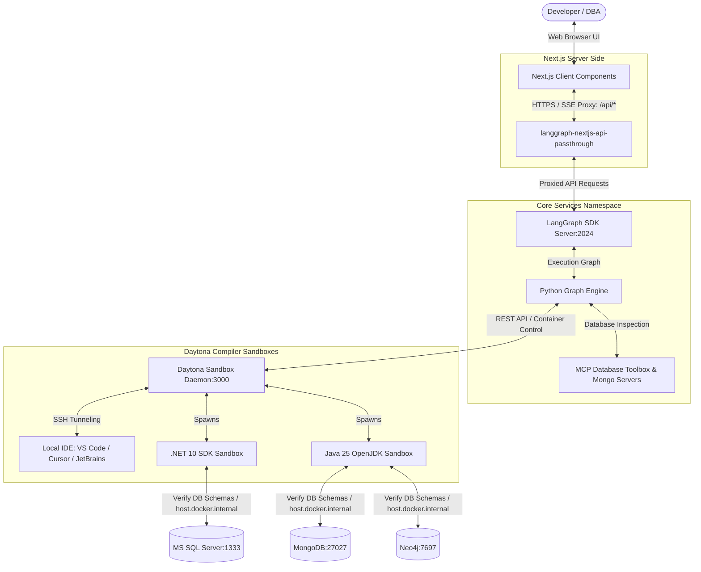

# UOM Assistant Frontend: System Architecture & Routing Design

This document provides a detailed technical breakdown of the architecture, routing layers, security proxy mechanisms, and state propagation flow implemented in the **Universal Object Mapping (UOM)** frontend dashboard.

---

## 1. System Topology & Communication Interfaces

The UOM frontend acts as a responsive, real-time control cockpit. It interfaces between the user, the LangGraph orchestrator service, the MCP database schema checkers, and the isolated Daytona sandbox execution environments.



### 1.1 Client-Server Boundaries
*   **Next.js Frontend (`localhost:3001` or Port `3020`)**: Executed entirely in the client browser. It runs the UI layout, holds temporary config values, manages active thread context, and renders stream output.
*   **Next.js API Passthrough Proxy**: Executed on the Next.js server node. It routes requests, injects credentials, and shields sensitive downstream APIs from client visibility.
*   **LangGraph SDK Server (`localhost:2024`)**: Orchestrates the translation steps, runs agent iterations, manages the thread history database (using Postgres and Redis checkpointers), and coordinates with the compilation sandboxes.

---

## 2. Next.js API Passthrough Routing & Security

To prevent sensitive API keys and system URLs (such as LangSmith project keys, Daytona tokens, or Metacentrum e-INFRA cluster credentials) from leaking to the client browser, the frontend implements a server-side routing proxy.

### 2.1 Proxy Implementation & File Mappings
The UOM Translator UI (`frontend/uom-translator-ui`) specialized proxy to route client-server requests to LangGraph Agent Server utilizing the standard Node.js server environment to allow full filesystem mapping and larger buffer transfers:

*   **File Path**: [`frontend/uom-translator-ui/app/api/[..._path]/route.ts`](../../frontend/uom-translator-ui/app/api/%5B..._path%5D/route.ts)
*   **Runtime**: `nodejs`
*   **Code Implementation**:
    ```typescript
    import { initApiPassthrough } from "langgraph-nextjs-api-passthrough";
    
    export const { GET, POST, PUT, PATCH, DELETE, OPTIONS, runtime } =
    	initApiPassthrough({
    		apiUrl: process.env.LANGGRAPH_API_URL,   // E.g., http://localhost:2024
    		apiKey: process.env.LANGSMITH_API_KEY,   // Injected securely on the server
    		runtime: "nodejs",
    	});
    ```

### 2.2 Routing Mechanics
When the frontend SDK initiates thread searches, fetches state checkpoints, or sends stream runs, it directs requests to the browser-accessible endpoint `/api/threads` or `/api/runs`. The Next.js server intercepts these routes, appends authorization headers (`x-api-key`), and proxies the payload to the internal LangGraph server URL (`LANGGRAPH_API_URL`). This setup shields backend APIs from public inspection.

---

## 3. Client-Side SDK Initialization

The frontend utilizes the `@langchain/langgraph-sdk` client to communicate with the Next.js API proxy routes.

*   **File Path**: [`frontend/uom-translator-ui/lib/chatApi.ts`](../../frontend/uom-translator-ui/lib/chatApi.ts)

### 3.1 Client Factory Implementation
To ensure the SDK client routes through the server proxy rather than trying to hit internal backend networks directly, the client is initialized using a dynamic resolution factory:
```typescript
import { Client } from "@langchain/langgraph-sdk";

export const createClient = () => {
	const apiUrl =
		process.env.NEXT_PUBLIC_LANGGRAPH_API_URL ||
		(typeof window !== "undefined"
			? new URL("/api", window.location.href).href
			: "/api");
	return new Client({ apiUrl });
};
```
*   **Browser/Server Resolution**: If `NEXT_PUBLIC_LANGGRAPH_API_URL` is not provided, the factory checks if it is running in the client browser (`typeof window !== "undefined"`). If so, it computes the absolute URL based on the current window host (resolving to `/api`), directing calls through the proxy route.

---

## 4. Context & State Propagation Flow

State distribution across the translation workspace is managed through a central React Context layer, ensuring synchronization between the conversational stream and UI panels (like the progress banner or compilation error logs).

*   **File Path**: [`frontend/uom-translator-ui/hooks/use-graph-state-context.ts`](../../frontend/uom-translator-ui/hooks/use-graph-state-context.ts)

### 4.1 State Context Type Signatures
The React Context exposes variables to monitor active nodes and capture compilation failures:
```typescript
export interface GraphStateContextType {
	graphState: Partial<BackendState>;
	error: { message: string; error?: any } | null;
	setError: (error: { message: string; error?: any } | null) => void;
	runError: { message: string; error?: any } | null;
	setRunError: (error: { message: string; error?: any } | null) => void;
	activeNode: keyof typeof NODE_NAME_MAP | null;
}
```

### 4.2 Context Assertion Hook
The hook `useGraphStateContext` enforces verification to guarantee that components accessing active graph states reside within a valid state provider hierarchy:
```typescript
import { useContext } from "react";
import { GraphStateContext } from "@/hooks/use-graph-state-context";

export const useGraphStateContext = () => {
	const context = useContext(GraphStateContext);
	if (context === undefined) {
		throw new Error(
			"useGraphStateContext must be used within a GraphStateProvider",
		);
	}
	return context;
};
```

---

## 5. UI Style Resolution & Tailwind Integrations

The UOM Assistant uses a styled component layer built on top of Tailwind CSS utilities and custom stylesheets.

*   **File Path**: [`frontend/uom-translator-ui/lib/utils.ts`](../../frontend/uom-translator-ui/lib/utils.ts)

To avoid conflicts during dynamic CSS class injection (e.g., merging layout alignments or padding overrides inside message components), the application routes styles through a class merger:
```typescript
import { type ClassValue, clsx } from "clsx";
import { twMerge } from "tailwind-merge";

export function cn(...inputs: ClassValue[]) {
	return twMerge(clsx(inputs));
}
```
*   **Resolution Process**: `clsx` resolves conditional arrays, key-value classes, and nested string inputs into a unified class string. `twMerge` then parses the Tailwind classes and overrides redundant or conflicting properties, ensuring the last declared style takes precedence.
