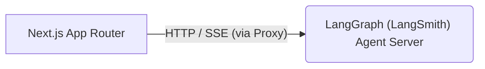

# Universal Object Mapping (UOM) Assistant UI

This is the Next.js App Router frontend dashboard for the **Universal Object Mapping (UOM)** system. It provides an interactive chat workspace built on top of [`assistant-ui`](https://github.com/assistant-ui/assistant-ui) that allows developers to interact with the LangGraph state orchestrator.



---

## 1. Features

### 1.1 Core `assistant-ui` & LangGraph Integration Features
*   **Custom Chat Workspace Primitives**: Leverages `assistant-ui` React primitives (`ThreadPrimitive`, `MessagePrimitive`, `ComposerPrimitive`) to build a responsive, custom-styled interface suited for schema translation.
*   **LangGraph Agent Server Integration**: Uses the `@assistant-ui/react-langgraph` runtime adapter to connect directly to the LangGraph REST/SSE streaming API, managing token streaming, agent state transitions, and cancellation runs natively.
*   **Multi-Thread Session Synchronization**: Synchronizes thread history (creating, listing, and switching conversations) with the backend persistent checkpoint stores (Redis/Postgres) through native `assistant-ui` adapters.
*   **Reasoning & Tool Call Rendering**: Renders intermediate agent reasoning steps (LLM scratchpads) and visualizes Model Context Protocol (MCP) toolbox calls in real-time as collapsible components.

### 1.2 Custom Translation & Operational Features
*   **State-Aware UI Progress Tracker**: Maps internal LangGraph node IDs in real-time to user-friendly execution steps (e.g. *Inspecting Database Schema*, *Validating Query Logic*), displaying progress as a visual stepper.
*   **Onboarding & Configuration Panel**: Allows users to configure remote OpenAI-compatible clusters (such as e-INFRA CZ), local Ollama instances, database connection strings, and Daytona sandbox limits.
*   **Daytona IDE Integration**: Fetches sandbox details and provisions SSH connection tokens to open your local IDE (VS Code, Cursor, JetBrains Gateway) directly inside the Daytona sandbox.
*   **Streaming JSON Trees**: Uses `partial-json` to decode incomplete JSON code blocks in real-time, rendering them inside interactive tree components.
*   **Interactive Suspended Interventions**: Suspends the runtime when validation retries are exhausted, showing build outputs and DeepDiff logs, and providing buttons to Accept or Reject & Correct the code.

---

## 2. Getting Started

### 2.1 Prerequisites
*   **Node.js**: Version 24+
*   **pnpm**: Version 11+
    *   `npm` is also possible, but `pnpm` is recommended for faster installs. If changing dependency manager, update the configuration in `package.json` accordingly. Some tweaks to deployment may also be required (Dockerfile, etc.).

### 2.2 Local Setup

1.  **Configure Environment Variables**:
    Configure environment variables and add your secret keys:
    ```bash
    cp .env.example .env.development # For local development
    cp .env.example .env.production # For production builds
    ```
2.  **Install Dependencies**:
    ```bash
    pnpm install
    ```
3.  **Start the Dev Server**:
    Either start the entire stack (Next.js Dev Server + LangGraph Dev Server via `langgraph dev` + LLMock LLM Mock Server - the request/response fixtures are already set up for the sample input/outputs) with:
    ```bash
    pnpm run dev
    ```
    or run the Next.js frontend separately if you have the backend running:
    ```bash
    pnpm run dev:frontend
    ```
    Open your browser to `http://localhost:3001` (since Daytona runs on `3000` by default).

---

## 3. Detailed Documentation Directory

For deep dives into the frontend's architecture, components, and workflows, refer to the following documents in the global [`docs`](../../docs) folder:

*   **[Global Frontend Overview](../../docs/frontend/overview.md)**: Workspace features, layouts, and capabilities.
*   **[Global Frontend Architecture](../../docs/frontend/architecture.md)**: API proxies, Client SDK wrappers, and context distribution.
*   **[Global Frontend Runtime & Integration](../../docs/frontend/runtime.md)**: LangGraph streams, subgraphs, checkpoint recovery, and manual interrupts.
*   **[Global Frontend UI Components](../../docs/frontend/components.md)**: Settings modal, remote IDE link parsing, and auto-scroll observers.
*   **[Global Frontend Setup & Deployment](../../docs/frontend/setup.md)**: Environment configs, Docker multi-stage pipelines, and Biome coding standards.
*   **[Global User & Operator Guide](../../docs/frontend/user_guide.md)**: Manual for performing migrations, troubleshooting, and correcting agent errors.
*   **[Global DevOps Setup & Operations](../../docs/devops/devops.md)**: DevOps profiles, network bridges, container topologies, and automation scripts.
