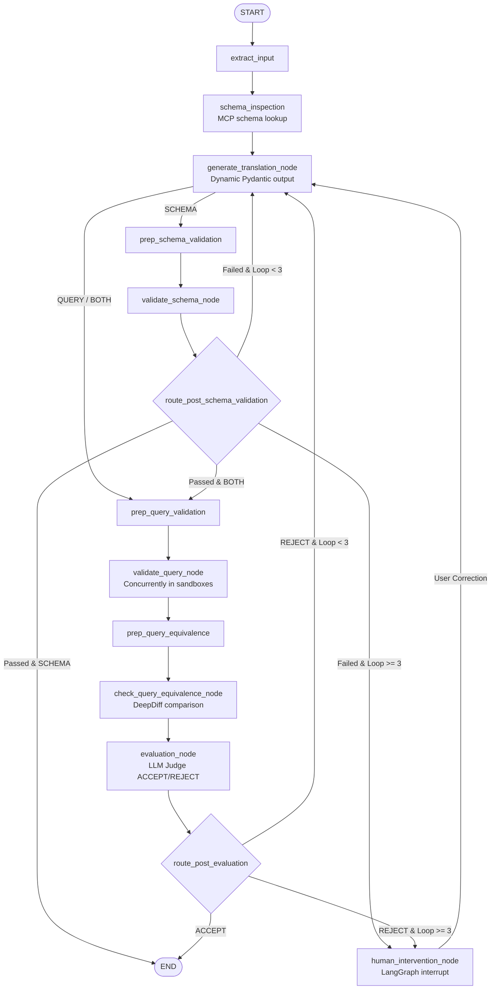

# Universal Object Mapping (UOM) Orchestrator

The UOM Orchestrator is the core LLM orchestration engine for the Universal Object Mapping (UOM) system. It is a Python-based service utilizing [LangGraph](https://github.com/langchain-ai/langgraph) to drive a semi-deterministic, multi-turn [Object-Relational Mapping (ORM)](https://en.wikipedia.org/wiki/Object%E2%80%93relational_mapping), [Object-Document Mapping (ODM)](https://www.geeksforgeeks.org/dbms/comparison-between-orm-and-odm/), and [Object-Graph Mapping (OGM)](https://docs.spring.io/spring-data/neo4j/reference/introduction-and-preface/preface-sdn.html) translation workflow.


## What it Does

The orchestrator translates relational database schemas and queries from .NET frameworks ([Entity Framework Core](https://github.com/dotnet/efcore), [Dapper](https://github.com/DapperLib/Dapper), [NHibernate](https://github.com/nhibernate/nhibernate-core)) to NoSQL target environments in Java ([Spring Data MongoDB](https://docs.spring.io/spring-data/mongodb/reference/), [Spring Data Neo4j](https://docs.spring.io/spring-data/neo4j/reference/)).

The system executes a semi-deterministic pipeline rather than relying on unstructured, single-agent tool loops (which are prone to token bloat and hallucination). The workflow utilizes specialized compiler and execution sandboxes managed via the [Daytona API](https://www.daytona.io/) to compile, execute, and verify target query results using deep semantic equivalence checks before finalized output is committed.


## Deterministic Translation Workflow

The orchestrator’s state graph ensures correctness through strict, multi-layered verification gates:



1. **Extraction (`extract_input`)**: Parses incoming user requests using strict Pydantic definitions (`ExtractionOutput`) to identify frameworks, versions, and code blocks.
2. **Schema Inspection (`schema_inspection`)**: Retrieves ground-truth relational and target database schemas via Model Context Protocol (MCP) servers to gather database mapping context.
3. **Translation Generation (`generate_translation_node`)**: Translates C# schemas/queries into Java target classes and scripts. Uses a runtime Pydantic model generator to dynamically exclude irrelevant fields based on requested translation scope to optimize tokens.
4. **Isolated Compilation (`validate_schema_node` / `validate_query_node`)**: Packs the compiled code using Base64 strings and executes compilation within isolated Daytona container sandboxes (.NET and Java OpenJDK) using concurrent bash scripts (`dotnet build` or `mvn compile`).
5. **Equivalence Testing (`check_query_equivalence_node`)**: Compares relational SQL Server outputs and target Mongo/Neo4j query results. Uses `DeepDiff` on background threads to evaluate semantic equivalence, tolerating floating-point precision drift and swapped sorting orders.
6. **Judge Evaluation (`evaluation_node`)**: A separate LLM judge reviews compiler stderr outputs and equivalence diffs, deciding to `ACCEPT` or `REJECT`.
7. **Correction Loops**: If rejected, the system loops back to generate fixes (up to 3 times), injecting compiler diagnostic errors directly into the model's scratchpad.
8. **Human-in-the-Loop (`human_intervention_node`)**: If compilation remains broken after 3 loops, the execution is suspended via LangGraph `interrupt()`, rendering generated code, stack traces, and diffs to the user for manual adjustment.


## Technology Stack

- **Core Engine**: Python 3.11+ managed with `uv`.
- **Workflow Framework**: [LangGraph](https://github.com/langchain-ai/langgraph) / [LangChain](https://github.com/langchain-ai/langchain) / [Deep Agents](https://github.com/langchain-ai/deepagents) all used in different parts of the project to create an LLM (Large Language Models) orchestration workflow using semi-deterministic graph structure and its abstractions.
- **Isolated Sandboxes**: [Daytona API Client](https://github.com/daytonaio/daytona) for container snapshotting, state recovery, and log streaming.
- **Observability & Telemetry**: [Logfire](https://github.com/pydantic/logfire) for structured request tracing and telemetry; [LangSmith](https://docs.langchain.com/langsmith/observability) for LLM execution inspection.
- **Deployment**: [LangSmith Agent Server](https://docs.langchain.com/langsmith/agent-server) for serving standardized backend REST endpoints.
- **Additional REST Endpoints**: [FastAPI](https://fastapi.tiangolo.com/) for serving standard backend REST endpoints.
- **ACP (Agent Client Protocol) Integration**: Allowing IDE plugins and CLI tooling to call the agent workspace directly. See [ACP Guide](https://agentclientprotocol.com/get-started/introduction).


## Documentation Index

The UOM Orchestrator is comprehensively documented. Review the following modular documentation files under the [docs](docs) directory for extensive, verbose analyses of the internal logic, algorithms, and modules:

1. **[docs/architecture.md](docs/architecture.md)**: Overarching architecture topology, node-by-node functional matrix, conditional transition logic, and a detailed StateGraph diagram.
2. **[docs/state_and_context.md](docs/state_and_context.md)**: LangGraph state representations, Pydantic field specifications, configuration context (`Context`), reflective environment loading (`__post_init__`), and our custom message isolation boundaries (`translation_messages` vs `messages`).
3. **[docs/sandbox_environment.md](docs/sandbox_environment.md)**: Isolation container specs (SDK 10.0 and OpenJDK 25 CDS), Daytona snapshots provisioning, exponential wait backoffs, container state recovery routines, real-time log streaming custom events, and remote file retrieval.
4. **[docs/validators_and_equivalence.md](docs/validators_and_equivalence.md)**: Compilation harnesses creation, Base64 payload packaging, Maven and .csproj builds, reverse-parsing stdout shell streams, DeepDiff tolerance configuration, background thread scheduling, and the swapped sorting orders algorithm.
5. **[docs/deep_agent_and_acp.md](docs/deep_agent_and_acp.md)**: ACP DeepAgent build configurations, composite environment routing, local monorepo context detection using parallel bash subshells, summarization index cutoffs, and session authorization modes (`ask_before_edits`, `accept_edits`, `accept_everything`).
6. **[docs/mcp_integration.md](docs/mcp_integration.md)**: Model Context Protocol (MCP) integrations, Database Toolbox and MongoDB MCP server client binding, SSE and streamable HTTP connections, host gateway translations (`localhost` to host-gateway IP), and graceful catch-and-fallback policies.


## Quick Setup & Run

To run, develop, or test the UOM Orchestrator locally, follow the steps below. The orchestrator uses the fast `uv` tool for python virtual environment synchronization, and Daytona to orchestrate Docker containers for validation. Once running, Daytona automatically provisions clean sandbox environments from snapshots to perform compile-and-execute validations, while your relational, document, and graph databases are mapped securely through translated host-gateway networking protocols.

### Development Requirements & Setup

Before getting started, make sure your system has the following core components installed and configured:

- **Runtime**: Python 3.11+ (Python 3.13 recommended); Node.js/NPM 24+; Linux/WSL on Windows (Windows might be buggy sometimes).
- **Package & VirtualEnv Manager**: `uv` package manager (which significantly accelerates installs and sync actions compared to raw pip).
- **Daytona Daemon & CLI**: Daytona installed and running locally (active local docker target) to spin up compilation sandboxes.
- **Docker Engine**: Running Docker daemon (native Docker on Linux or Docker Desktop) to host Daytona sandbox workspaces.
- **Model API Credentials**: API access keys for remote OpenAI-compatible services (like [e-INFRA CZ](https://docs.cerit.io/en/docs/ai-as-a-service/introduction)) or a running local instance of [Ollama](https://ollama.com/) (e.g. running Kimi K2.6+ or DeepSeek v4 Pro models).
- **Databases**: Healthy running instances of relational **MS SQL Server** (source ORM), **MongoDB** (target ODM), and **Neo4j** (target OGM) databases. These can be run in native Docker containers or locally on the host machine.
- **MCP Servers**: Healthy running instances of Google Database Toolbox MCP and MongoDB MCP server to enable structured database metadata retrievals.

#### 1. Environment Configurations
Copy `.env.example` to `.env` (or `.env.dev` for local testing) and supply the credentials for the Daytona API, LLM providers (e.g. [e-INFRA CZ](https://docs.cerit.io/en/docs/ai-as-a-service/introduction), [Ollama](https://ollama.com/), or any OpenAI compatible provider), and database hosts:
```bash
cp .env.example .env
```

Ensure the database addresses (MSSQL, MongoDB, Neo4j) are defined. The orchestrator will automatically translate `localhost` references into Daytona host-gateway IPs.

#### 2. Environment Creation
If you are running this project on Linux and are prompted, type:

```bash
direnv allow
```
to setup the environment automatically. Otherwise, use scripts in [Makefile](Makefile):
```bash
make install
```

#### 3. Direct LangGraph Development Server
To inspect and run the graph using the LangSmith Agent Studio interface with hot-reloading:
```bash
make dev
```

#### 4. Run as an ACP Agent Session (Optional)
If connecting via the Agent Client Protocol (e.g., from an IDE extension), use the available configuration and point the entrypoint to [run_acp_agent.sh](run_acp_agent.sh) bash script.
This executes the ACP agent server loop, listens on standard input/output channels, provisions containers for .NET and Java execution, and loads workspace directories via shell backend.


### Useful Development commands

- **Install Dependencies**: `uv sync --all-extras`
- **Run AI Mock server**: `make record_requests` to also record new requests or `make mock_server` to use available fixtures (testing).
- **Run Unit & Sandbox Tests**: `make test`
- **Run Integration Scenarios**: `make integration_tests`
- **Formatting and Lints**: `make format && make lint`
